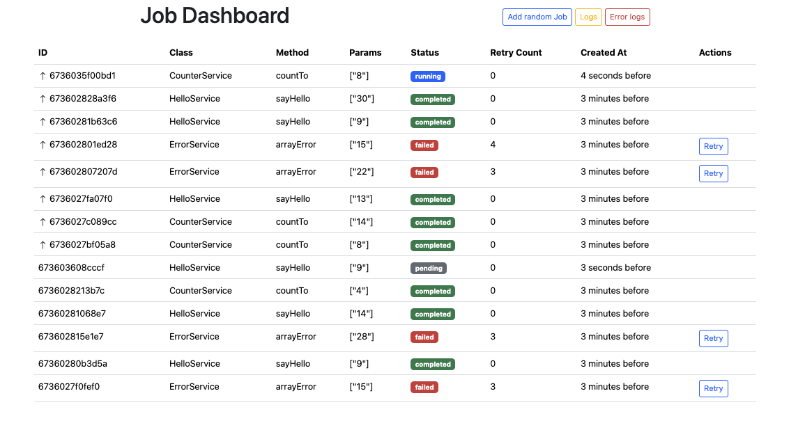

<p align="center"><a href="https://laravel.com" target="_blank"></a></p>

## Custom Background Job Runner

### Requirements

- **PHP** (version 8.0 or higher)
- **Redis** (installed and running)
- **Composer** (to manage PHP dependencies)

### Installation

Follow the steps to run the project:

**1.** Clone this repository.

```terminal
git clone https://github.com/murilorr90/job-runner
cd job-runner
```

**2.** Use Composer to install project dependencies:

```terminal
composer install
```

**3.** Create a copy of .env.example file with your database/app settings and generate keys:

```terminal
cp .env.example .env
php artisan key:generate
```

**4.** Run the queue and laravel server (two different tabs)
```terminal
php artisan startQueue
php artisan serve
```

**5.** You can execute any jobs in the background using the following command:
```terminal
php artisan startJob {CLASSNAME} {FUNCTION} --params={PARAMS} --delay={NUMBER_IN_SECONDS} --high-priority
```
### Some rules
- Class and method must exist inside \App\Services folder;
- You can use _**runBackgroundJob**_ function in any part of the project;
- Change the _**RETRY_COUNT**_ in the .env file to set the number of retries;
- Because the task has a job priority, the Background Runner doesn't allow run multiple jobs in parallel;
- In the dashboard, you can see the status of every job and run examples;
  

The dashboard will be available at http://localhost:8000


**That's it, thanks!**

### Contributing

Made by Murilo Rocha.
